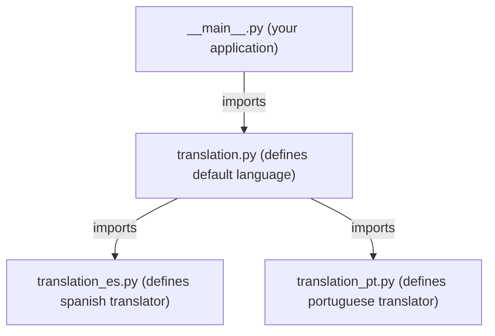
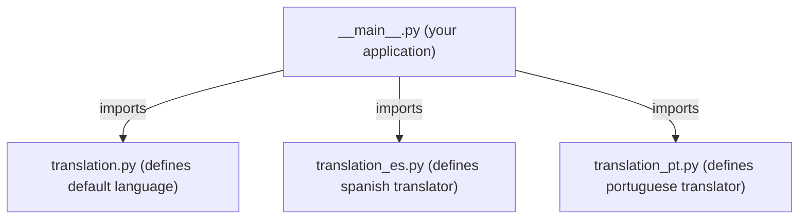

# Minimal string translation library for Python

This is not a full internationalization library, nor suitable for usual translation workflows.
Make sure it meets your needs.
If not, there are other libraries that do the job, for example,
[gettext](https://docs.python.org/3/library/gettext.html).

## How to use

Define all translatable strings in an enumeration class.
You **must** also define a `_lang` attribute and set its value
to the corresponding locale or language string.
A list of valid locale strings can be found at [saimana.com](https://saimana.com/list-of-country-locale-code/).

For example:

```python
from enum import Enum

class EN(Enum):
    _lang = "en"
    TEST = "English, all countries"

class ES_MX(Enum):
    _lang = "es_MX"
    TEST = "Spanish, Mexico"
```

Those enumerations are called **translators** in the context of this library.
In order to use them, you must "install" all of them at initialization:

```python
from appstrings import install

install(EN)
install(ES_MX)
```

The library will check that all installed translators enumerate the same set of constants.

The function `gettext()` is used for translation. For example:

```python
from appstrings import gettext

print(gettext(EN.TEST))
```

You may want to alias `gettext` to `_` for convenience:

```python
_ = gettext

print(_(EN.TEST)) # Print translated string, depending on current locale
```

The library chooses the best-matching translator for the current translation locale, which is initialized from `locale.getlocale()`.
You may force a specific locale for translation:

```python
from appstrings import set_translation_locale

set_translation_locale("pt_BR")
print(_(EN.TEST))
```

then force the system locale again:

```python
set_translation_locale()
```

In the previous example there is no translator for the locale *pt_BR*. In such a case, the parameter given to `gettext()` will work
as the **default language** for non-translated locales. In the example, brazilian people would read the text in english.
However, if you call `print(_(ES_MX.TEST))` instead, brazilian people would read the text in spanish.

You may spread your translators along many source files as long as your application imports them.

For example:



But the following schema will work just the same:



The "translation*.py" files would look like this:

```python
from enum import Enum
from appstrings import install

class CertainTranslator(Enum):
    _lang = ...
    TEXT1 = ...
    TEXT2 = ...
    ...

install(CertainTranslator)
```

In the later schema, the ability to change the default language at any time comes from aliases:

```python
from appstrings import gettext
# import your translators here

STR = AnyTranslator
_ = gettext

print(_(STR.TEXT1))
```
